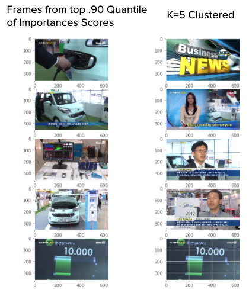

# Exploration of Video Summarization Techniques

Video summarization is the compression of a full video into a series of key shots or sequences. The goal is to reduce a video into a shorter form, but using an algorithmic approach for efficiency when dealing with a batch of videos or long-form video. Examples of video summarization applications include generating sports highlights such as soccer goals or basketball shots.

The general goal of an algorithmic approach to video summarization is to capture the key differentiating video components of a video and group the frames that compose these components into a slide show, or select the important sequences to compose a short-form video. For this project I only accounted for the visual components of video.

### Dataset

For the project I used the TVSum Dataset of 50 videos compiled for research on video summarization, across 10 categories including vehicles, beekeeping, and parkour. [The TVSum dataset can be accessed here](https://github.com/yalesong/tvsum).

A challenge in video summarization is finding video data with labels for important frames - the videos from the TVSum dataset included 20 crowdsourced scores from 1-5 for each 2 second sequence in a video. This served as the “ground truth” when comparing the outcomes of the video prediction models. For this project, I only took into account the visual components of a video.

### Methodology

#### Clustering

I began with an approach of working with a single video using the technique of K Means clustering to group video frames into distinct clusters and select key frames in a video to put together a summary. In the case of generating features for a video, the first step was to decompose the video into a series of frames. I used the pretrained VGG16 Convolutional Neural Network to extract features from each frame. VGG16 is a 16 layer CNN trained on millions of images and yields a feature representation of visual features when applied to a new unseen image.

After creating the feature set with VGG16, I applied the KMeans clustering algorithm to separate the frames of a video into a specific number of clusters, determined by how many images to include in a slideshow. I then selected frames closest to the center of each cluster to compose the ordered groups of key frames.

Below is a comparison of key frames selected from a news video from South Korea on electric cars. The crowdsourced importance frames place more weight on the sequences showcasing the videos, while the clustering approach focuses on different speakers.

*Image frame extraction and recomposition is a derivative of ["Creative Commons Electric cars making earth more green"](https://www.youtube.com/watch?v=akI8YFjEmUwm) Youtube video by [itstvnz](https://www.youtube.com/channel/UCI39rqMClkXZAAZfCIqln3g) used under [CC BY](https://creativecommons.org/licenses/by/3.0/legalcode)*

In order to account for the context of a video, I needed to group together batches of videos for training and also account for the relevance of time within a video.

For example, a news video may include a commentator at the beginning and end of a video, both of which may be relevant for the video as a whole even though they are not visually distinct.

#### Long Short Term Memory Network

To account for time as a factor, I used a long-short-term memory neural network. The LSTM uses the previous history of inputs to predict the current output. This is important for video data as the time in which a scene occurs may greatly impact its relevance for the video as a whole.

The first step was to extract VGG16 features across all videos, and this was an extended process which took a few hours. I trained a model using these VGG16 features with the crowdsourced importance scores as my target variable. I tested both a general model using 18 videos across categories and models training on specific categories. Over 15 epochs, training time ranged from 10-20 minutes. Overall, I found that my results were quite poor for the general model. This was likely due to the significant differences in categories combined with the relatively small quantity of videos per category. I shifted my focused towards training category specific models with approximately 30,000 frames of training data per category.

Using 4 training videos per category, these are the results for a test video in the bike tricks and parkour video categories, comparing the crowdsourced scores with the predicted scores for each video’s sequence of frames. Root mean squared error is .61 for the bike tricks video and .47 for the parkour video. The LSTM predicted scores show a lot more variance and noise, but they capture many of the significant peaks and distribution of the crowdsourced scores.

This is an example of the vehicles category with the electric cars test video. The scatter of actual and predicted scores though shows an upward trend, but there is significant variance and noise in the predicted scores. But similar to the previous categories, the predicted scores roughly capture the distribution of scores for the crowdsourced video.

#### Summary

- Video summarization using the approach of clustering and LSTM can both be effective methodologies to generate static or dynamic summaries
- Category based models can be effective methods of identifying important frames with a time sequence of video data
- To apply models to new videos, there is likely to be a lack of labeled data of importance scores for frames. A new methodology of using existing summarized versions as training data with generative adversarial networks may be effective an approach

#### References

- TVSum dataset - https://github.com/robi56/video-summarization-resources
- "Video Summarization Using Keyframe Extraction and Video Skimming" - https://arxiv.org/pdf/1910.04792.pdf
- "Video Summarization Using Clustering" - https://pdfs.semanticscholar.org/7fac/bc3ea6324fbda6e9db8ab4aec25100e59e9b.pdf
- "Video Summarization with Long Short-term Memory" - http://www-scf.usc.edu/~zhan355/ke_eccv2016.pdf

